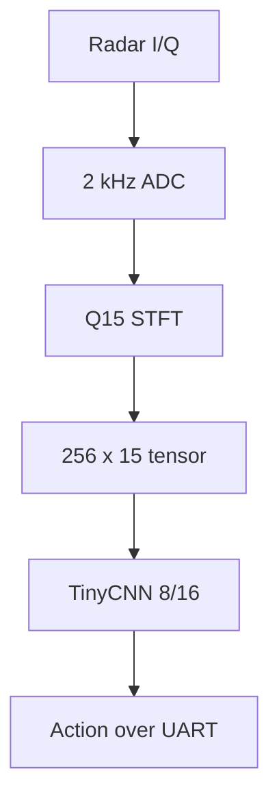

# Model_Phase

`Model_Phase` runs the complete radar-gesture classifier on the
MSP430FR5994. The board samples the BGT60LTR11AIP radar, creates the Q15
spectrogram, runs the integer TinyCNN, and sends the detected action to the
computer.

The computer only displays the result. Spectrogram processing and inference
are performed on the MSP430.

## Supported actions

| ID | Output class |
|---:|---|
| 0 | Left horizontal scroll |
| 1 | Right horizontal scroll |
| 2 | Clicking hand |
| 3 | Empty |

## Input and output

### Hardware input

| Radar pin | MSP430 input |
|---|---|
| `IFI` | `P3.0 / A12` |
| `IFQ` | `P3.1 / A13` |
| `GND` | Common ground |

The firmware samples one I/Q pair at 2 kHz.

### Model input

- Shape: `1 x 256 x 15` (`channel x frequency x time`)
- Storage on the MSP430: `spectrogram[15][256]`
- Values: integer log-power features from 0 to 31
- Observation window: approximately 1.024 seconds

### Output

The MSP430 sends a CRC-protected `D4` packet containing:

- detection number;
- predicted class ID; and
- four signed class logits.

`cnn_result_monitor.py` converts the class ID into a readable action name.

## Implemented pipeline



The preprocessing contract is fixed:

| Setting | Value |
|---|---:|
| Sampling rate | 2,000 Hz |
| FFT size | 256 |
| Hop | 128 samples |
| Window | Q15 Hann |
| Clutter filtering | First difference, `DIFF_SHIFT=4` |
| FFT implementation | DSPLib/LEA fixed-scale Q15 |
| Feature | `fftshift(floor(log2(I^2 + Q^2)))` |
| Number of STFT columns | 15 |

Do not change these values without regenerating the dataset and retraining and
re-exporting the model.

## Model and experiment summary

The deployed network is the 8/16-channel TinyCNN:

- Conv1: 8 channels, 2 x 2 kernel
- Conv2: 16 channels, 2 x 2 kernel
- Fully connected layer: 512 inputs to 4 classes
- Parameters: 2,620
- Nominal complexity: approximately 83,968 MACs
- Integer weights and biases: approximately 5.3 KB
- CNN activation scratch: 96 bytes

Validation results from three training seeds:

| Seed | Accuracy | Macro-F1 |
|---:|---:|---:|
| 7 | 82.92% | 82.58% |
| 42 | 85.00% | 84.88% |
| 123 | 83.33% | 83.30% |
| **Mean +/- sample SD** | **83.75% +/- 1.10%** | **83.59% +/- 1.18%** |

The seed-42 model was selected for deployment. Its integer reference achieved
85.83% validation accuracy and 85.73% macro-F1. Python and host-compiled C
inference produced identical predictions and logits for all 240 validation
tensors.

The final reserved test set was not evaluated during model selection.

## Main files

| File | Purpose |
|---|---|
| `main.c` | Acquisition, STFT scheduling, CNN execution, and UART reporting |
| `inc/STFT.h`, `src/STFT.c` | Embedded Q15 STFT |
| `inc/radar_configuration.h`, `src/radar_configuration.c` | ADC, timers, UART, DMA, and packet configuration |
| `inc/radar_cnn.h`, `src/radar_cnn.c` | Integer TinyCNN inference |
| `inc/cnn_weights.h`, `src/cnn_weights.c` | Exported model parameters |
| `New Python Files/stft_protocol.py` | UART packet parser |
| `New Python Files/cnn_result_monitor.py` | Human-readable prediction monitor |
| `New Python Files/test1_adc_rate.py` | ADC-rate and transport check |

## Requirements

- Code Composer Studio with MSP430 support
- TI MSP430 compiler `21.6.2.LTS`
- MSP430FR5xx/6xx DriverLib
- MSP DSPLib `1.30.00.02`
- Python 3 and PySerial

In CCS, define `DSPLIB_ROOT` as the local DSPLib installation directory. The
important include paths are:

```text
${PROJECT_ROOT}/inc
${PROJECT_ROOT}/driverlib/MSP430FR5xx_6xx
${DSPLIB_ROOT}/include
```

## Build and flash

1. Import `Model_Phase` as an existing CCS project.
2. Select the `MSP430FR5994` target.
3. Use the verified **Debug** configuration.
4. Confirm the DriverLib, DSPLib, and `inc` paths.
5. Clean and rebuild the project.
6. Confirm that `Debug/Model_Phase.out` and `Debug/Model_Phase.map` are created.
7. Flash `Model_Phase.out`, resume execution, and reset the board once.

The current Debug map uses 3,684 of 4,096 bytes of conventional RAM. Check the
map after adding buffers or changing the model because SRAM margin is small.

## Run the result monitor

Set the machine-specific values once:

```powershell
$trentoProjectsRoot = "C:\path\to\TrentoProjects"
$modelPhaseRoot = Join-Path $trentoProjectsRoot "Model_Phase"
$hostTools = Join-Path $modelPhaseRoot "New Python Files"
$pythonEnvironment = Join-Path $env:USERPROFILE "venvs\modelzoo\Scripts\Activate.ps1"
$port = "COM7"
```

Activate the environment and start the monitor:

```powershell
Set-ExecutionPolicy -Scope Process Bypass
& $pythonEnvironment
Set-Location $hostTools

python -u .\cnn_result_monitor.py `
    --port $port `
    --duration 120 |
ForEach-Object {
    "$(Get-Date -Format 'HH:mm:ss.fff')  $_"
}
```

Example from the verified board run:

```text
23:02:42.998  Connected to COM7. Waiting for CNN results...
23:02:44.730  23:02:44.727 | Detection #385 | Detected action: Right horizontal scroll
23:02:46.731  23:02:46.730 | Detection #386 | Detected action: Right horizontal scroll
23:02:48.833  23:02:48.832 | Detection #387 | Detected action: Clicking hand
23:02:50.758  23:02:50.758 | Detection #388 | Detected action: Right horizontal scroll
...
23:04:41.265  23:04:41.264 | Detection #443 | Detected action: Right horizontal scroll
23:04:43.194  23:04:43.193 | Detection #444 | Detected action: Left horizontal scroll
23:04:43.194  Results received: 60 | CRC errors: 0 | resyncs: 0
```

This test produced 60 results in 120 seconds: approximately one prediction
every 2 seconds, with zero CRC errors and zero parser resynchronizations.

The detection counter is maintained by the MSP430, so it does not restart when
the Python monitor is reopened. The command above shows two timestamps because
the Python script and PowerShell wrapper each add one.

## Quick acquisition check

Close the CNN monitor before running another serial tool. Then reset the board
and run:

```powershell
python -u .\test1_adc_rate.py `
    --port $port `
    --sampling-rate 2000 `
    --duration 15
```

A healthy system should report close to 2,000 accepted samples/s, zero MCU
drops, and zero CRC errors.

## What to do

- Verify `IFI`, `IFQ`, power, and common ground before flashing or collecting
  data.
- Keep the radar orientation and gesture directions consistent with training.
- Use 2 kHz explicitly in diagnostic commands.
- Open the COM port with only one program at a time.
- Check `Model_Phase.map` after every memory-related change.
- Keep the checkpoint, architecture, quantization settings, and generated C
  weights together.
- Repeat Python-to-C parity tests after changing preprocessing, model code, or
  weights.

## What not to do

- Do not swap or disconnect `IFI` and `IFQ`; valid-looking but misleading
  spectrograms can still be produced.
- Do not use old 4 kHz comments or script defaults. The deployed system is
  2 kHz.
- Do not replace only `cnn_weights.c` with parameters from another architecture.
- Do not return to the earlier 16/32-channel CNN; its on-board inference was
  much slower.
- Do not treat logits as confidence percentages.
- Do not evaluate the reserved test set while still selecting models.
- Do not expect a stationary hand to be recognized correctly. The model has no
  `stationary_hand` or `unknown` class and must choose one of its four outputs.

## Future improvements

The current project is a working inference prototype. The planned low-power
version should:

- sleep while no movement is present;
- wake from a low-cost motion detector;
- check capacitor voltage before acquisition or inference;
- checkpoint progress in FRAM before energy failure;
- resume interrupted STFT or CNN work after power returns;
- disable diagnostic spectrogram traffic in production; and
- add an `unknown` or `stationary_hand` class or a movement gate.

## Related projects

- `Raw_Data_Capture`: labeled I/Q collection and tensor export
- `STFT_Parity`: Python/MSP430 STFT comparison
- [`tinysystems/modelzoo`](https://github.com/tinysystems/modelzoo/): upstream
  University of Trento training framework used as the basis of the local radar
  training project

## Credits

Developed during a research internship at the University of Trento. Special
thanks to **Prof. Kasım Sinan Yıldırım** for mentorship and research guidance,
and to **Beran Kılıç** for technical and practical support.
